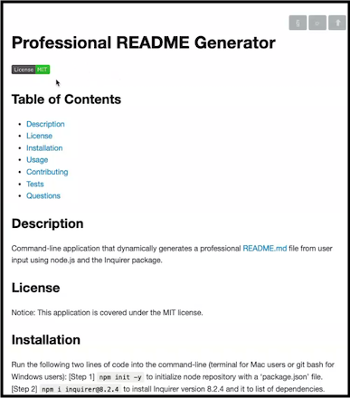
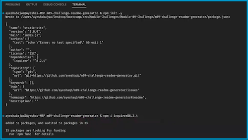
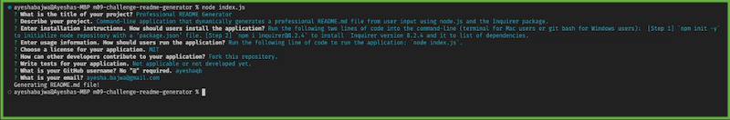

# Professional README Generator

## Table of Contents

- [Description](#description)

- [Demo](#demo)

- [License](#license)

- [Installation](#installation)

- [Usage](#usage)

- [Contributing](#contributing)

- [Tests](#tests)

- [Questions](#questions)

## Description

Command-line application that dynamically generates a professional README.md file from user input using node.js and the Inquirer package.

## Demo

A demo of this application can be viewed here:

<https://drive.google.com/file/d/10ln3TfdLevR966nrV1jHnnNanBIh3zwB/view?usp=sharing>

## License

Notice: This application is covered under the MIT license.
  
## Installation

Run the following two lines of code into the command-line (terminal for Mac users or git bash for Windows users):  [Step 1] `npm init -y` to initialize node repository with a ‘package.json’ file. [Step 2] `npm i inquirer@8.2.4` to install  Inquirer version 8.2.4 and it to list of dependencies.

## Usage

Run the following line of code to run the application: `node index.js`.

## Contributing

Fork this repository.

## Tests

Not applicable or not developed yet.

## Questions

Please reach out on GitHub (@ayeshaqb) or via email (ayesha.bajwa@gmail.com) with any questions!
